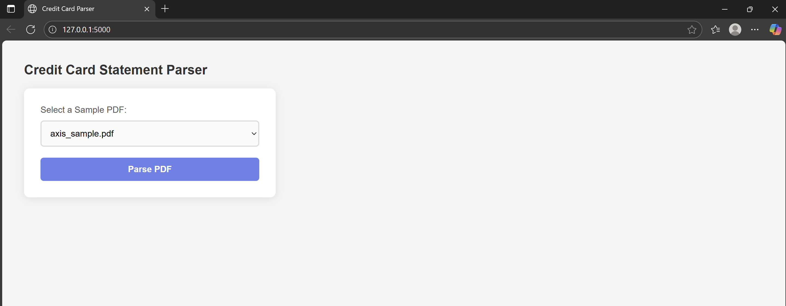

# Credit Card Statement Parser

A Python Flask web application that automatically extracts key details from credit card PDF statements of major Indian banks — **ICICI**, **HDFC**, **AXIS**, **SBI**, and **KOTAK**. It identifies the bank and retrieves essential information such as **Bank Name, Cardholder Name, Card Last 4 Digits, Billing Cycle, Payment Due Date**, and **Total Amount Due**. The app intelligently handles different statement formats and neatly displays the extracted information on a results page.
 

---

## Features

- Extracts critical details from PDF credit card statements  
- Supports multiple banks and PDF formats  
- Robust extraction for Total Amount Due, including ₹ symbol  
- Unicode support with DejaVuSans font  
- Web interface for selecting PDFs and displaying results  
- Sample PDFs included with dummy transactions for testing  

---

## Tech Stack

- **Python**  
- **Flask**  
- **PyMuPDF (fitz)**  
- **ReportLab** (for PDF generation)  

---

## Demo Screenshots

### Homepage

### Parsed Result

